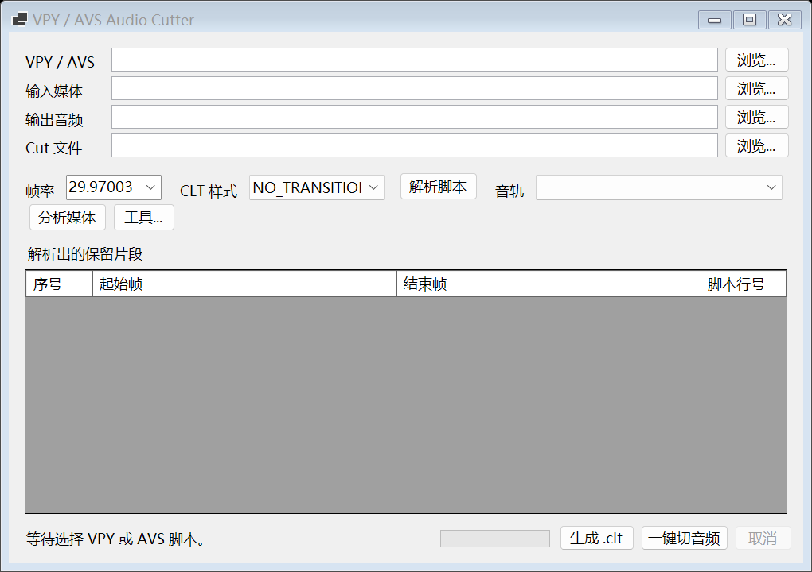

# VPY Audio Cutter

[](https://github.com/kingofotaku/vpy-audio-cutter/actions/workflows/build.yml)

一个 Windows GUI 小工具：静态读取 VapourSynth `.vpy` 或 AviSynth `.avs` 中的 `Trim` 调用，从音频文件或视频容器中选择音轨并一键切割，同时生成标准 `.clt` 文件。



## 支持的写法

```python
trim = core.std.Trim(src, 3253, 84170)
trim = src.trim(1541, 38262)
trim = core.std.Trim(src, first=100, last=200)
trim = core.std.Trim(src, first=100, length=101)
__t0 = __film.trim(4579, 132251)
clip = Trim(4144, 126827)
clip = Trim(first_frame=100, last_frame=200)
```

注释和字符串中的 `Trim` 不会被读取。工具不会执行 VPY，也不会加载 VapourSynth 插件。

## 运行前准备

GitHub Release 只包含本程序、README 和 MIT License，不捆绑任何第三方二进制。

| 文件 | 是否必需 | 用途 |
| --- | --- | --- |
| `BeSplit.exe` | 按音轨格式决定 | AAC、AC3、DTS、MP2、MP3、PCM、WAV 使用 MeGUI Audio Cutter 兼容流程时必需。通常位于 `MeGUI\tools\besplit\BeSplit.exe`。 |
| `ffmpeg.exe` | 使用视频容器或非 BeSplit 格式时必需 | 分析 TS、M2TS、MKV、MP4 等容器的音轨；作为 eac3to 抽取失败时的 fallback；处理 FLAC、E-AC3、Opus 等格式。 |
| `eac3to.exe` | 可选，推荐 | 优先从 TS/M2TS 等容器直接抽取音轨。不存在或抽取失败时自动改用 ffmpeg。通常位于 `MeGUI\tools\eac3to\eac3to.exe`。 |

外部工具可以采用任意一种配置方式：

1. 将对应 `.exe` 放在 `VpyAudioCutter.exe` 同目录。
2. 直接使用已有 MeGUI 安装目录中的工具。
3. 将 ffmpeg 加入系统 `PATH`。
4. 在程序的“工具...”菜单中手动选择路径。

工具路径会保存到 `%LocalAppData%\VpyAudioCutter\settings.json`。

下载框架依赖版时，需要安装 Windows x64 的 .NET 8 Desktop Runtime。自包含版不需要安装 .NET。

## 使用

1. 解压 Release，运行 `VpyAudioCutter.exe`。
2. 选择 VPY 或 AVS 脚本。
3. 选择输入音频或视频容器。支持 TS、M2TS、MKV、MP4 等 ffmpeg 可读取的格式。
4. 在“音轨”下拉框确认要处理的音轨。容器音轨会优先由 eac3to 无转码抽取，失败时改用 ffmpeg。
5. 输出扩展名会根据所选音轨自动填写。
6. 从帧率下拉框选择，或手动输入实际帧率，例如 `23.976024` 或 `29.97003`。工具会记住上次选择。
7. 点击“解析脚本”检查帧区间。
8. 第一次使用时按提示选择缺少的外部工具。
9. 点击“一键切音频”。

VPY 的 `Trim(first,last)` 是包含首尾帧的闭区间。工具转换为 BeSplit 的半开时间区间：

```text
[first / fps, (last + 1) / fps)
```

因此 `Trim(100, 100)` 仍会保留第 100 帧，不会少一帧。

AviSynth 的位置参数有额外规则：

- `Trim(0, -4)` 表示保留 4 帧，即 0–3。
- `Trim(100, 0)` 表示从第 100 帧到片尾。静态解析无法知道片尾帧，因此会显示警告并跳过。
- `Trim(0, end=0)` 明确表示只保留第 0 帧。
- `Trim(3, length=5)` 表示保留 3–7。

## 音频处理路线

BeSplit 支持的格式与 MeGUI Audio Cutter 保持一致：AAC、AC3、DTS、MP2、MP3、PCM、WAV。这些格式会复刻 MeGUI 的 BeSplit split/join 流程。

其他格式使用 ffmpeg 自适应处理：

- 所有目标切点均对齐压缩音频包边界时，使用 stream copy，不重新编码。
- 任一切点不对齐时，在 PCM 域按采样点精确裁切并拼接，然后只编码一次回原格式。
- 即使切点对齐，也会验证输出采样数和关键时长元数据。FLAC 等格式若 stream copy 产生错误元数据，会自动回退到同格式重编码。
- 不改变采样率，也不会自动转换为 AAC。

Blu-ray PCM 会输出为同位深 WAV。eac3to 缺失时，ffmpeg 会执行等价的无损 PCM 格式转换。

## 外部工具

程序会依次检查已保存路径、程序同目录、程序下的 `tools` 目录、由 BeSplit 路径推断出的 MeGUI `tools` 目录、正在运行的 MeGUI 和系统 `PATH`。仍未找到时会弹出文件选择框。

BeSplit、eac3to 和 ffmpeg 分别遵循各自的许可协议，本项目不对它们进行再分发。

## 构建

```powershell
dotnet build .\VpyAudioCutter.sln -c Release
dotnet run --project .\tests\VpyAudioCutter.Tests\VpyAudioCutter.Tests.csproj -c Release
dotnet run --project .\tests\VpyAudioCutter.UiSmoke\VpyAudioCutter.UiSmoke.csproj -c Release
```

运行 `publish.ps1` 会同时生成：

- 自包含单文件版。
- 需要本机 .NET 8 Desktop Runtime 的小体积框架依赖版。

## 致谢

本工具的 `.clt` 工作流、Audio Cutter 交互思路以及 BeSplit split/join 调用方式受到开源项目 [MeGUI](https://github.com/Kurtnoise-zeus/megui) 的启发。感谢 MeGUI 项目及其贡献者长期以来为视频压制社区提供的工具和源码参考。

本项目是独立开发的第三方工具，不是 MeGUI 官方组件，也不代表 MeGUI 项目维护者。

## License

本项目使用 MIT License。外部工具不包含在本许可证范围内。
